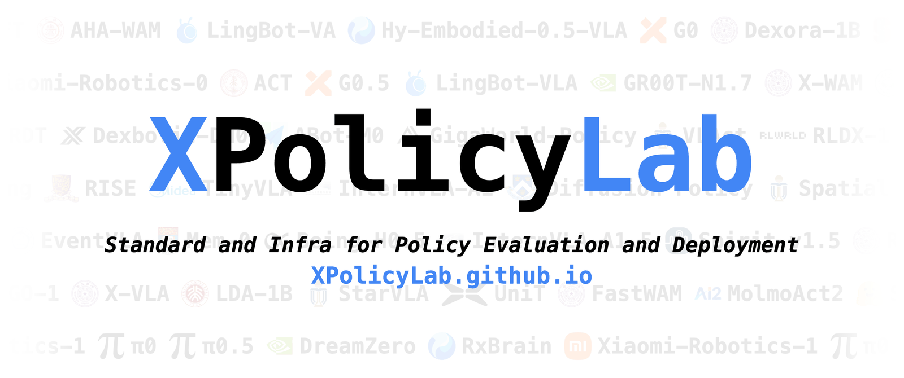
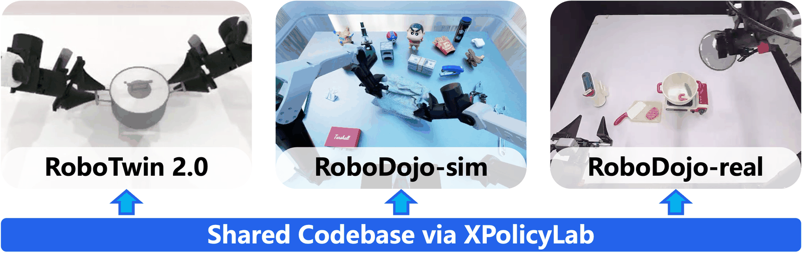
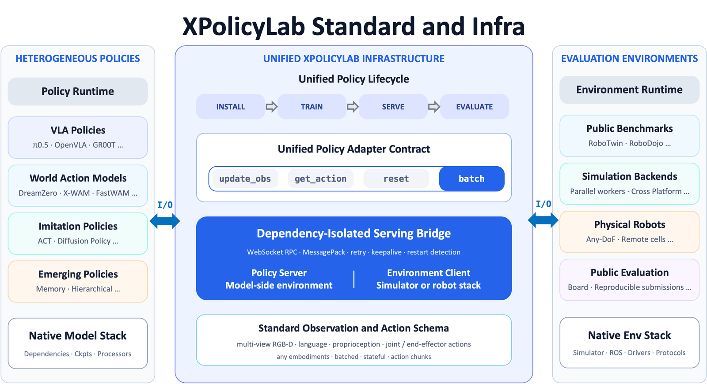

<div align="center">

<h1>XPolicyLab</h1>

<p>English | <a href="README_zh.md">简体中文</a></p>

<p><strong>A Unified Standard and Open Ecosystem for Robot Policy Evaluation and Deployment</strong></p>

<p>
<a href="https://xpolicylab.github.io/">Website</a> |
<a href="https://arxiv.org/abs/2608.09892">arXiv</a> |
<a href="https://github.com/XPolicyLab/XPolicyLab">GitHub</a> |
<a href="https://robodojo-benchmark.com/LeaderBoard">RoboDojo Leaderboard</a> |
<a href="https://robotwin-platform.github.io/leaderboard">RoboTwin Leaderboard</a>
</p>



<p><em>Connecting N policies to M evaluation environments — from O(N×M) down to O(N+M).</em></p>

</div>


XPolicyLab is the shared layer between policy code and evaluation environments. Keep each model's dependencies, checkpoints, and training recipes under `policy/<POLICY>/`; XPolicyLab handles the parts that are boring but easy to get wrong — serving, observation/action contracts, and eval wiring. As of September 2026, the ecosystem integrates **44 robot policies** spanning VLA, world-action, imitation-learning, and memory-augmented families, and the same adapters serve RoboTwin, RoboDojo simulation, and standardized real-robot evaluation.

Start here for repo-level concepts and integration steps. For install commands, checkpoint layout, and training details, jump to that policy's README — it is the source of truth for its model.

## 📚 Contents

- [What XPolicyLab Enables](#-what-xpolicylab-enables)
- [Supported Benchmarks And Infrastructure](#-supported-benchmarks-and-infrastructure)
- [Integrated Policies](#-integrated-policies)
- [Framework Overview](#-framework-overview)
- [Quick Start](#-quick-start)
- [Common Workflow](#-common-workflow)
- [Deployment Flow](#-deployment-flow)
- [Standard Data Formats](#-standard-data-formats)
  - [Decode only through `decode_image_bit`](#decode-only-through-decode_image_bit)
  - [Official LeRobot conversion](#official-lerobot-conversion)
- [Data And Checkpoints](#-data-and-checkpoints)
- [Add Your Own Policy](#-add-your-own-policy)
- [Coding Agents](#-coding-agents)
- [Citation](#-citation)
- [Contact](#-contact)


## 🚀 What XPolicyLab Enables

- **Environment isolation**: run the policy model in its own conda/uv environment while the simulator, benchmark, or robot client runs separately.
- **Remote deployment**: connect the policy server and environment client through websocket, either on one machine or across machines.
- **A common adapter contract**: use the same high-level lifecycle for installation, data conversion, training, serving, and evaluation.
- **A large policy zoo**: reuse adapters for VLA/WAM policies, imitation-learning baselines, and reference templates.
- **Benchmark and infra integration**: mount XPolicyLab into benchmark or simulator workspaces without coupling policy code to one environment.


## 🌐 Supported Benchmarks And Infrastructure

XPolicyLab is benchmark-agnostic: any benchmark, simulator, or real-robot setup can plug in as an environment client against the same policy-side interface — one adapter per policy, one client per environment. The benchmarks below are already integrated; the RoboDojo and RoboTwin official leaderboards are powered by XPolicyLab submissions.

<div align="center">

<p><em>Cross-platform evaluation through a shared codebase and standardized serving interface.</em></p>
</div>

**Benchmarks**

- **[RoboDojo](https://github.com/RoboDojo-Benchmark/RoboDojo)**: simulator-backed evaluation and RoboDojo-format data exports. The [RoboDojo Leaderboard](https://robodojo-benchmark.com/LeaderBoard) covers 42 simulation tasks across five capability dimensions (Generalization, Precision, Long-Horizon, Memory, Open) plus 18 real-robot tasks on three bimanual embodiments.
- **[RoboTwin](https://github.com/RoboTwin-Platform/RoboTwin)**: benchmark and data source through policy-specific adapters and conversion scripts. The [RoboTwin 2.0 Leaderboard](https://robotwin-platform.github.io/leaderboard) covers bimanual manipulation across 50 tasks under clean and randomized settings.
- **[RMBench](https://github.com/RoboTwin-Platform/RMBench)**: memory-dependent manipulation benchmark built on RoboTwin 2.0, with nine dual-arm tasks spanning levels of task memory complexity ([paper](https://arxiv.org/abs/2603.01229), [website](https://rmbench.github.io/)). Its reference policy is integrated as [Mem-0](policy/Mem_0/README.md).

**Infrastructure**

- **[RLinf](https://github.com/RLinf/RLinf)** *(coming soon)*: infrastructure target for policy development and deployment workflows.
- **StarVLA**: infrastructure and policy stack; see [policy/starVLA](policy/starVLA/README.md).


## 🧭 Integrated Policies

44 policies are currently integrated, spanning VLA, world-action, imitation-learning, and memory-augmented families, plus [demo_policy](policy/demo_policy/README.md) as the minimal reference adapter. Top-level adapters live in `policy/`; each policy README documents that model's paper/repo link, environment, data format, training entrypoint, and checkpoint layout.


| Policy                                   | Policy                                               | Policy                                      | Policy                                                     | Policy                                                         | Policy                                            |
| ---------------------------------------- | ---------------------------------------------------- | ------------------------------------------- | ---------------------------------------------------------- | -------------------------------------------------------------- | ------------------------------------------------- |
| [A1](policy/A1/README.md)                | [AHA-WAM](policy/AHA_WAM/README.md)                  | [ABot-M0](policy/Abot_M0/README.md)         | [Being-H05](policy/Being_H05/README.md)                    | [DM0](policy/Dexbotic_DM0/README.md)                           | [Dexora-1B](policy/Dexora_1B/README.md)           |
| [DreamZero](policy/DreamZero/README.md)  | [EventVLA](policy/EventVLA/README.md)                | [FastWAM](policy/FastWAM/README.md)         | [G0](policy/GalaxeaVLA/README.md)                          | [G0.5](policy/G05/README.md)                                   | [GO-1](policy/GO1/README.md)                      |
| [GR00T-N1.7](policy/GR00T_N17/README.md) | [GigaWorld-Policy](policy/GigaWorldPolicy/README.md) | [H-RDT](policy/H_RDT/README.md)             | [Hy-Embodied-0.5-VLA](policy/Hy_Embodied_05_VLA/README.md) | [InternVLA-A1](policy/InternVLA_A1/README.md)                  | [InternVLA-A1.5](policy/InternVLA_A1_5/README.md) |
| [LDA-1B](policy/LDA_1B/README.md)        | [LingBot-VA](policy/LingBot_VA/README.md)            | [LingBot-VLA](policy/LingBot_VLA/README.md) | [Meituan-Robotics-0](policy/Meituan_Robotics_0/README.md)  | [Mem-0](policy/Mem_0/README.md)                                | [MolmoAct2](policy/MolmoAct2/README.md)           |
| [OLA-SEM](policy/OLA_SEM/README.md)      | [OpenDM](policy/OpenDM/README.md)                    | [OpenVLA-OFT](policy/OpenVLA_OFT/README.md) | [OpenWAM](policy/OpenWAM/README.md)                        | [π0](policy/Pi_0/README.md)                                    | [π0.5](policy/Pi_05/README.md)                    |
| [π0-Fast](policy/Pi_0_Fast/README.md)    | [RDT-1B](policy/RDT_1B/README.md)                    | [RISE](policy/RISE/README.md)               | [SmolVLA](policy/SmolVLA/README.md)                        | [Spatial Forcing](policy/Spatial_Forcing/README.md)            | [Spirit v1.5](policy/Spirit_v15/README.md)        |
| [TinyVLA](policy/TinyVLA/README.md)      | [X-VLA](policy/X_VLA/README.md)                      | [X-WAM](policy/X_WAM/README.md)             | [Xiaomi-Robotics-0](policy/Xiaomi_Robotics_0/README.md)    | [Xiaomi-Robotics-1 (XR-1)](policy/Xiaomi_Robotics_1/README.md) | [StarVLA](policy/starVLA/README.md)               |
| [ACT](policy/ACT/README.md)              | [DP](policy/DP/README.md)                            | [demo_policy](policy/demo_policy/README.md) |                                                            |                                                                |                                                   |


Adding a policy of your own, or entering a leaderboard, both go through a PR — see [Add Your Own Policy](#-add-your-own-policy).

## 🧩 Framework Overview

XPolicyLab separates model-side dependencies from environment-side dependencies, so each side retains its native stack and may run locally or remotely. One adapter serves benchmarks, simulators, and physical robots.

<div align="center">

<p><em>Infrastructure of XPolicyLab. One adapter serves benchmarks, simulators, and physical robots.</em></p>
</div>

```text
Policy environment                         Evaluation / benchmark environment
------------------                         ----------------------------------
policy/<POLICY>/model.py     <---ws--->    env client / simulator / robot
policy server                              environment client
deploy.yml deployment config               benchmark task and observation API
```

A typical adapter contains:

```text
policy/<POLICY>/
├── README.md                    # policy-specific guide
├── INSTALLATION.md              # optional detailed setup notes
├── __init__.py                  # keeps XPolicyLab.policy.<POLICY> importable
├── install.sh                   # environment setup
├── process_data.sh              # optional data conversion
├── train.sh                     # optional training
├── eval.sh                      # same-machine evaluation
├── setup_eval_policy_server.sh  # policy-side server
├── setup_eval_env_client.sh     # environment-side client
├── deploy.yml                   # deployment config
├── deploy.py                    # deployment loop
└── model.py                     # model adapter, served by the policy server
```

`model.py` implements the model-facing API. `deploy.py` bridges environment observations to model-server calls. Use [policy/demo_policy](policy/demo_policy/README.md) as the minimal adapter reference.

`model.py` should define a `Model` class with this shape:


| Method                                | Contract                                                                                                                                                                  |
| ------------------------------------- | ------------------------------------------------------------------------------------------------------------------------------------------------------------------------- |
| `__init__(model_cfg)`                 | Load model config, checkpoints, processors, and per-run overrides from `deploy.yml`.                                                                                      |
| `update_obs(obs)`                     | Update model state from one observation dictionary.                                                                                                                       |
| `update_obs_batch(obs_list)`          | Update model state from a list of observation dictionaries.                                                                                                               |
| `get_action()`                        | Return one action chunk as a list of action dictionaries.                                                                                                                 |
| `get_action_batch(env_idx_list=None)` | Return batched action chunks aligned with active environment indices.                                                                                                     |
| `reset()`                             | Clear model-side state between evaluation episodes. It takes no arguments — a policy that needs a first observation should `reset()` and then take a normal `update_obs`. |


The policy server decodes camera colors before `update_obs` / `update_obs_batch`, so `obs["vision"][<camera>]["color"]` always arrives as an image array — `model.py` never decodes.

The default policy-server protocol is websocket (`protocol: ws` in `deploy.yml`); `legacy_tcp` exists only for adapters that have not migrated yet. The transport handles reconnects, retries, keepalive, and long model-loading cold starts for you — a normal adapter never touches it.

<details>
<summary>Transport details and timeout tuning (only if evaluation hangs or drops)</summary>

- **Retries are safe**: each request carries a `request_id` that the client reuses across reconnects, and the server answers duplicates from a cache instead of running a non-idempotent call twice. A `timeout` error is the exception — the server may still be running the call, so treat it as fatal for that trial rather than retrying.
- **Server restarts abort the run**: if a reconnect lands on a different server process, the client raises `ServerRestartedError`, because the fresh server lost the model state.
- **Cold start**: the server loads the model before opening its port, so an early client just retries (default budget 15 min). `eval.sh` also gates the client behind `wait_for_policy_server.sh`.
- **Errors**: the client only sees `str(exc)`; the full traceback of a model failure is logged on the *policy server* side, so look there first.
- **Serialization** is msgpack with numpy support (`torch.Tensor` auto-converts). Three quirks: `tuple` arrives as `list`, decoded numpy arrays are read-only views (copy before in-place edits), and int dict keys arrive as strings.

Optional `deploy.yml` keys — omit them to keep the defaults:


| Key                                        | Default | Purpose                                                                         |
| ------------------------------------------ | ------- | ------------------------------------------------------------------------------- |
| `request_timeout_s`                        | `120.0` | Timeout for one `update_obs` / `get_action` call — raise it for slow inference. |
| `max_connect_attempts`                     | `180`   | Cold-start retries while the server is still loading.                           |
| `connect_retry_delay_s`                    | `5.0`   | Delay between those retries.                                                    |
| `max_connect_seconds`                      | `900.0` | Wall-clock cap on the whole retry loop; `0` disables it.                        |
| `connect_timeout_s`                        | `30.0`  | Timeout for one connect attempt.                                                |
| `handshake_timeout_s`                      | `60.0`  | Timeout for the HELLO round-trip.                                               |
| `ws_ping_interval_s` / `ws_ping_timeout_s` | `20.0`  | Keepalive ping/pong; `null` disables.                                           |
| `close_timeout_s`                          | `10.0`  | Cap on the closing handshake.                                                   |

</details>


## ⚡ Quick Start

Clone XPolicyLab as a normal Python project for adapter development, offline checks, training from prepared data, or your own environment client:

```bash
mkdir demo_env
cd demo_env
git clone https://github.com/XPolicyLab/XPolicyLab.git
cd XPolicyLab
pip install -e .
```

You do not need a simulator to start model-side development: the bundled downloader fetches prepared RoboDojo data — several simulator export versions plus HDF5 `RoboDojo_real` real-world data — for training and offline debugging. If you use `XPolicyLab/` as a subpackage inside the RoboDojo repository, follow RoboDojo's own data download scripts instead.

Download a small Hugging Face demo bundle and keep the data next to `XPolicyLab/`:

```bash
# From demo_env/XPolicyLab
bash scripts/RoboDojo/download_robodojo_data.sh demo
```

This creates:

```text
demo_env/
├── data/        # demo data, including a small 10-episode HuggingFace bundle
└── XPolicyLab/
```

The same script pulls the full exports — `hdf5`, `lerobot_v3.0`, `lerobot_v2.1`, and `real` (real-world HDF5) — each into its own `../data/` folder. The two LeRobot exports come from the [official converters](#official-lerobot-conversion), so you can regenerate them for your own task subset or resolution.

With this setup, you can test data conversion, model loading, training scripts, and debug-mode evaluation before connecting to a simulator-backed benchmark.

```bash
export EVAL_ENV_TYPE=debug
cd policy/demo_policy
bash install.sh
bash eval.sh RoboDojo stack_bowls demo arx_x5 joint 0 0 0 base base
```

The template for any adapter is the same — swap `demo_policy` and the argument values:

```bash
export EVAL_ENV_TYPE=debug
cd policy/<POLICY>
bash eval.sh <bench_name> <task_name> <ckpt_name> <env_cfg_type> <action_type> \
  <seed> <policy_gpu_id> <env_gpu_id> <policy_env_or_uv_path> <eval_env_conda_env>
```

For RoboDojo simulation, mount `XPolicyLab/` beside the simulator-side `env_cfg/`, `scripts/`, `src/eval_client/`, and `task/` directories.

## 🔄 Common Workflow

Most adapters expose the same top-level shape. Some policies add extra arguments, consume upstream-native datasets, or skip training support. Follow the policy README when it differs from this template.

```bash
cd policy/<POLICY>

# Install the policy environment.
bash install.sh

# Optional: convert or prepare policy-specific data.
bash process_data.sh <bench_name> <ckpt_name> <env_cfg_type> <action_type> [extra_args...]

# Optional: train.
bash train.sh <bench_name> <ckpt_name> <env_cfg_type> <action_type> <seed> <gpu_id> [extra_args...]

# Evaluate on one machine.
bash eval.sh <bench_name> <task_name> <ckpt_name> <env_cfg_type> <action_type> <seed> \
  <policy_gpu_id> <env_gpu_id> <policy_env_or_uv_path> <eval_env_conda_env>
```


### What the arguments mean

When you run `eval.sh`, you are mostly answering: **which benchmark family**, **which task to run now**, **which checkpoint to load**, **which robot setup**, **joint or end-effector actions**, and **which seed**. The same names travel through `process_data.sh`, `train.sh`, and `eval.sh`, so you do not have to rename things at every step.


| Argument                       | In plain English                                                                 | Examples                                                                 |
| ------------------------------ | -------------------------------------------------------------------------------- | ------------------------------------------------------------------------ |
| `bench_name`                   | Which benchmark or dataset family this run belongs to                            | `RoboDojo`, `RoboTwin`                                                   |
| `task_name`                    | The task the environment client should run right now                             | `stack_bowls`, `push_T` — can differ from the tasks seen during training |
| `ckpt_name`                    | Which weights to load: a short run nickname, the full run folder name, or a path | `cotrain`, `RoboDojo-cotrain-arx_x5-joint-0`, `checkpoints/my_run/`      |
| `env_cfg_type`                 | Robot / camera / scene configuration key                                         | `arx_x5`                                                                 |
| `action_type`                  | Action space the policy outputs                                                  | usually `joint` or `ee`                                                  |
| `seed`                         | Training or evaluation seed / layout id                                          | `0`, `1`, `2`                                                            |
| `policy_gpu_id` / `env_gpu_id` | Which GPU runs the model vs. the simulator/client                                | `0`, `1`                                                                 |
| `policy_env_or_uv_path`        | Conda env name or uv env path for the policy server                              | your policy-side env                                                     |
| `eval_env_conda_env`           | Conda env for the simulator / robot client                                       | your eval-side env                                                       |


**How `ckpt_name` resolves.** Usually you pass the short nickname used during training, such as `cotrain`, and XPolicyLab combines it with the other args into `checkpoints/RoboDojo-cotrain-arx_x5-joint-0/`. You can also pass the full folder name, or a path — relative paths resolve from the policy directory, absolute paths work too. Some adapters honor explicit keys in `deploy.yml` (`checkpoint_path`, `model_path`, ...). When in doubt, check the policy README.

**A concrete eval example:**

```bash
cd policy/AHA_WAM
bash eval.sh RoboDojo stack_bowls cotrain arx_x5 joint 0 0 0 aha_wam robodojo
# loads checkpoints/RoboDojo-cotrain-arx_x5-joint-0/ and evaluates on stack_bowls
```


## 🔌 Deployment Flow

During evaluation, the policy server and the environment client talk over websocket. That split is what lets you keep Isaac Sim / robot drivers on one machine and a heavy VLA on another.

For same-machine evaluation, `eval.sh` is enough — it starts the server, runs the client, and cleans up when you are done.

For split-machine deployment, start the policy server on the GPU machine and bind to `0.0.0.0` so other machines can reach it. The client connects to the policy machine's real IP, not `0.0.0.0`.

```bash
cd policy/<POLICY>
bash setup_eval_policy_server.sh \
  <bench_name> <task_name> <ckpt_name> <env_cfg_type> <action_type> <seed> \
  <policy_gpu_id> <policy_env_or_uv_path> <policy_server_port> 0.0.0.0
```

Then start the environment client on the simulator or robot machine:

```bash
cd policy/<POLICY>
bash setup_eval_env_client.sh \
  <bench_name> <task_name> <ckpt_name> <env_cfg_type> <action_type> <seed> \
  <env_gpu_id> <eval_env_conda_env> <additional_info> \
  <policy_server_port> <policy_server_ip>
```

`<additional_info>` is a comma-separated `key=value` string forwarded to the environment client. `eval.sh` builds it automatically as `ckpt_name=<ckpt_name>,action_type=<action_type>`, which is the right default for most adapters.

`EVAL_ENV_TYPE` selects the environment-side backend:

- unset or `sim`: real simulator-backed evaluation, when the integration is installed.
- `debug`: offline wiring check — no Isaac, no robot, just shapes and IO.
- `real`: real-robot client path, where the hardware integration exists.


## 📐 Standard Data Formats

XPolicyLab standardizes the observation and trajectory dictionaries passed between adapters, converters, and environment clients. Individual policies may convert this standard format into their upstream-native format.

### Decode only through `decode_image_bit`

> **Always decode through `decode_image_bit`, and always encode through `encode_image_bit`.** Both live in `XPolicyLab.utils.process_data`. Decoding image bits yourself is unsupported, because they come in two byte formats and a hand-rolled decoder is right on one and reverses the channels on the other. `decode_image_bit` tells them apart and returns RGB for every version of the data, so its output never needs a channel swap. Offline conversion and training must go through it. Runtime observations arrive already decoded, so `model.py` must not decode at all.

Stored image bits come in two formats, and both decode to RGB:


| Format       | How it was written                                                                                          | What a standard decoder sees                                                                                           |
| ------------ | ----------------------------------------------------------------------------------------------------------- | ---------------------------------------------------------------------------------------------------------------------- |
| **legacy**   | an RGB array handed straight to `cv2.imencode`, which reads its input as BGR                                | red and blue swapped — the bytes are channel-reversed against the JPEG standard, and `cv2.imdecode` reverses them back |
| **standard** | `encode_image_bit`, which converts to BGR first and stamps a JPEG `COM` segment with the payload `XPL-RGB1` | correct colors                                                                                                         |


Legacy data is never migrated — JPEG cannot swap channels losslessly — so the two formats coexist indefinitely and may appear in the same training run. The marker sits inside the buffer rather than in a file attribute so that a single buffer is self-describing, and `COM` is a standard segment that every decoder skips, so it costs 12 bytes and breaks nothing. If you must read these buffers without OpenCV, you can do it correctly: PIL surfaces the marker as `Image.open(...).info["comment"]`, so check for `b"XPL-RGB1"` and reverse the channels yourself when it is absent. What you cannot do is skip the check — a PIL-based loader tested against fresh data looks perfect and then quietly corrupts older episodes.

All pose values use `[x, y, z, qw, qx, qy, qz]`. Images are RGB end to end — `decode_image_bit` hands back RGB and no channel conversion happens anywhere else in the pipeline. Note one naming quirk: runtime observations carry camera extrinsics as `extrinsics_matrix`, while trajectory files store `extrinsic_matrix`.

<details>
<summary>Observation Data Format</summary>

```text
Observation Data Format
├── data_format_version                        string, optional
├── instruction / instructions                 string or list[str]
├── env_idx                                    int, optional for batched eval
├── additional_info/
│   └── frequency                              int, optional
├── vision/
│   ├── cam_head/
│   │   ├── color                              (H, W, 3) RGB, decoded by the server
│   │   ├── depth                              (H, W) or (H, W, 1), optional
│   │   ├── intrinsic_matrix                   (3, 3), optional
│   │   ├── extrinsics_matrix                  (4, 4), optional
│   │   └── shape                              (2,) or (3,), optional
│   ├── cam_left_wrist/                        optional
│   ├── cam_right_wrist/                       optional
│   ├── cam_wrist/                             optional for single-arm robots
│   └── cam_third_view/                        optional
└── state/
    ├── left_arm_joint_state                   (DOF,), optional
    ├── left_ee_joint_state                    (EEF_DOF,), optional
    ├── left_ee_pose                           (7,), optional
    ├── left_tcp_pose                          (7,), optional
    ├── left_delta_ee_pose                     (7,), optional
    ├── right_arm_joint_state                  (DOF,), optional
    ├── right_ee_joint_state                   (EEF_DOF,), optional
    ├── right_ee_pose                          (7,), optional
    ├── right_tcp_pose                         (7,), optional
    ├── right_delta_ee_pose                    (7,), optional
    ├── arm_joint_state                        (DOF,), optional for single-arm robots
    ├── ee_joint_state                         (EEF_DOF,), optional for single-arm robots
    ├── ee_pose                                (7,), optional for single-arm robots
    ├── tcp_pose                               (7,), optional for single-arm robots
    ├── delta_ee_pose                          (7,), optional for single-arm robots
    └── mobile/                                optional
        ├── base_pose                          (7,)
        └── base_twist                         (6,), [vx, vy, vz, wx, wy, wz]
```

</details>

<details>
<summary>Trajectory Data Format</summary>

```text
Trajectory Data Format
├── data_format_version                        string, e.g. "v1.0"
├── instruction / instructions                 string, or JSON-serialized list[str]
├── subtasks                                   JSON-serialized annotations, optional
├── additional_info/
│   └── frequency                              int
├── vision/
│   ├── cam_head/
│   │   ├── colors                             (T, H, W, 3), uint8 RGB or encoded stream
│   │   ├── depths                             (T, H, W) or (T, H, W, 1), optional
│   │   ├── intrinsic_matrix                   (3, 3) or (T, 3, 3), optional
│   │   ├── extrinsic_matrix                   (4, 4) or (T, 4, 4), optional
│   │   └── shape                              (2,) or (3,), optional
│   ├── cam_left_wrist/                        optional
│   ├── cam_right_wrist/                       optional
│   ├── cam_wrist/                             optional for single-arm robots
│   └── cam_third_view/                        optional
├── action/                                    action targets, same key naming as state/ below
└── state/
    ├── left_arm_joint_states                  (T, DOF), optional
    ├── left_ee_joint_states                   (T, EEF_DOF), optional
    ├── left_ee_poses                          (T, 7), optional
    ├── left_tcp_poses                         (T, 7), optional
    ├── left_delta_ee_poses                    (T, 7), optional
    ├── right_arm_joint_states                 (T, DOF), optional
    ├── right_ee_joint_states                  (T, EEF_DOF), optional
    ├── right_ee_poses                         (T, 7), optional
    ├── right_tcp_poses                        (T, 7), optional
    ├── right_delta_ee_poses                   (T, 7), optional
    ├── arm_joint_states                       (T, DOF), optional for single-arm robots
    ├── ee_joint_states                        (T, EEF_DOF), optional for single-arm robots
    ├── ee_poses                               (T, 7), optional for single-arm robots
    ├── tcp_poses                              (T, 7), optional for single-arm robots
    ├── delta_ee_poses                         (T, 7), optional for single-arm robots
    └── mobile/                                optional
        ├── base_poses                         (T, 7)
        └── base_twists                        (T, 6), [vx, vy, vz, wx, wy, wz]
```

</details>

Useful converter helpers:

```python
from XPolicyLab.utils.load_file import load_hdf5
from XPolicyLab.utils.process_data import (
    decode_image_bit,
    encode_image_bit,
    get_robot_action_dim_info,
)
```

`decode_image_bit` and `encode_image_bit` are the only supported codec for trajectory image bits (see [above](#decode-only-through-decode_image_bit)). They mirror each other's input handling — one frame or a sequence, in any of the containers the trajectory files use — and already-converted values pass through untouched. `get_robot_action_dim_info(env_cfg_type)` returns robot-specific `arm_dim` and `ee_dim` lists, so adapters do not need to hard-code action dimensions.

[CONTRIBUTING.md](CONTRIBUTING.md#modelpy) states the RGB exceptions and how a new robot gets registered in both `_robot_info.json` files.

### Official LeRobot conversion

Many policies train on LeRobot datasets instead of the trajectory format above. `scripts/transform_lerobot_v21_format.py` and `scripts/transform_lerobot_v30_format.py` are the official converters — one per LeRobot dataset version, both emitting the same keys.

<details>
<summary>LeRobot format</summary>

| Key | Shape | Content |
| --- | --- | --- |
| `observation.state` | `(D,)` float32 | `left_arm_joint_states` + `left_ee_joint_states` + `right_arm_joint_states` + `right_ee_joint_states`, concatenated in that order |
| `action` | `(D,)` float32 | same layout, from the trajectory's `action/` group |
| `observation.images.cam_high` | `(3, H, W)` video | `vision/cam_head/colors` |
| `observation.images.cam_left_wrist` | `(3, H, W)` video | `vision/cam_left_wrist/colors` |
| `observation.images.cam_right_wrist` | `(3, H, W)` video | `vision/cam_right_wrist/colors` |

</details>

Prepared LeRobot exports published for a benchmark — such as the `lerobot_v2.1` / `lerobot_v3.0` sets in [Quick Start](#-quick-start) — are produced this way, so a policy that consumes one needs no conversion step of its own.

> **A policy that trains on LeRobot data must say so in its own README**, under `Data Processing`: the dataset version, and whether the keys are the ones above. If they are, name the converter and say whether `process_data.sh` is absent or only links and normalizes the dataset. If they are not — an upstream-native layout, extra keys, a latent tree, different camera names — state the differences and how to produce that layout. [policy/RISE](policy/RISE/README.md) and [policy/AHA_WAM](policy/AHA_WAM/README.md) are worked examples of the first case, [policy/LingBot_VA](policy/LingBot_VA/README.md) of the second.

<details>
<summary>Running a conversion</summary>

Both scripts take `<bench_name>.<task_name>.<env_cfg_type>` glob patterns, read trajectories from `../data/` and robot dimensions from `../env_cfg/`, and merge every matched target into one dataset under `HF_LEROBOT_HOME/<repo_id>`. Run them from the repo root of a checkout that sits beside those two directories ([Quick Start](#-quick-start)).

```bash
# One robot, every task under it.
python scripts/transform_lerobot_v30_format.py "<bench_name>.*.<env_cfg_type>" --repo_id my_dataset

# Several robots merged, 50 episodes per task/env, downscaled.
# Without --resolution the target size comes from the first source frame.
python scripts/transform_lerobot_v21_format.py "<bench_name>.*.*" \
  --max_episode 50 --resolution 240x320
```

- **`D` is padded, not per-robot.** Each arm is zero-padded to the widest dimensions among the matched targets, so one dataset can mix robots; `robot_type` is `unified_robot` and motors are named `left_joint_<i>` / `right_joint_<i>`.
- **All three camera keys always exist.** A camera missing from the source is filled with black frames, so features stay stable across robots.
- **Images are RGB**, decoded through `decode_image_bit` and never swapped afterwards ([above](#decode-only-through-decode_image_bit)).
- **Joint-space bimanual only.** Both read the `*_arm_joint_states` / `*_ee_joint_states` keys and fail on a trajectory that carries only pose or single-arm keys.
- The two differ beyond dataset version only in encoding throughput: v3.0 writes images from 8 worker processes and streams video at CRF 18.

</details>


## 💾 Data And Checkpoints

Training and data prep usually name things predictably so eval can find them without guesswork:

```text
<bench_name>-<ckpt_name>-<env_cfg_type>-<action_type>
<bench_name>-<ckpt_name>-<env_cfg_type>-<action_type>-<seed>
```

So if you trained with `bench_name=RoboDojo`, `ckpt_name=cotrain`, `env_cfg_type=arx_x5`, `action_type=joint`, `seed=0`, the run lands in `checkpoints/RoboDojo-cotrain-arx_x5-joint-0/`. How `ckpt_name` maps back to these folders at eval time is covered in [Common Workflow](#-common-workflow).

Policies may also use upstream-native layouts or explicit paths in `deploy.yml`. Check the policy README before assuming a naming convention. For a small local dataset to play with, see [Quick Start](#-quick-start).

## 🤝 Add Your Own Policy

Community policies are welcome — open a PR that adds `policy/<POLICY>/`. A PR is also **required** to enter the official [RoboDojo](https://robodojo-benchmark.com/LeaderBoard) and [RoboTwin](https://robotwin-platform.github.io/leaderboard) leaderboards, together with the checkpoint that reproduces your results.

How to scaffold an adapter, what a submission must contain, the checks to run before a PR, and the PR template all live in [CONTRIBUTING.md](CONTRIBUTING.md). Start from [policy/demo_policy](policy/demo_policy/README.md), or `bash scripts/create_policy.sh <POLICY_NAME>`.

## 🤖 Coding Agents

Two skills under [.agents/skills](.agents/skills) are loaded by Cursor, Claude Code, and Codex (via `.cursor/skills` and `.claude/skills` symlinks). [AGENTS.md](AGENTS.md) is the always-on rule set.

- `xpolicylab-model-integration` — build an adapter. A prompt like `Integrate <POLICY_NAME> into XPolicyLab` is enough.
- `xpolicylab-adapter-check` — audit one before a PR (`Check policy/<POLICY_NAME>`).

The paste-in checklist for agents that load none of these is in [CONTRIBUTING.md](CONTRIBUTING.md#using-a-coding-agent).

## 📝 Citation

If XPolicyLab helps your research, please cite:

```bibtex
@article{community2026xpolicylab,
  title={{XPolicyLab}: A Unified Standard and Open Ecosystem for Robot Policy Evaluation and Deployment},
  author={Community, XPolicyLab and Chen, Tianxing and Chen, Yue and Nian, Tian and Cai, Zijian and Chen, Guangyu and Lin, Wenwei and Liang, Qiwei and Xiang, Peicheng and Su, Kailun and others},
  journal={arXiv preprint arXiv:2608.09892},
  year={2026}
}
```


## 📬 Contact

Tianxing Chen (project lead): [chentianxing2002@gmail.com](mailto:chentianxing2002@gmail.com)

A collaborative open-source project led by **MMLab@HKU** and **THU**.

**Core Lead Authors**: Tianxing Chen, Yue Chen, Tian Nian, Zijian Cai, Guangyu Chen, Wenwei Lin, Qiwei Liang.

The full contributor list — spanning every integrated policy — lives on the [project website](https://xpolicylab.github.io/).
