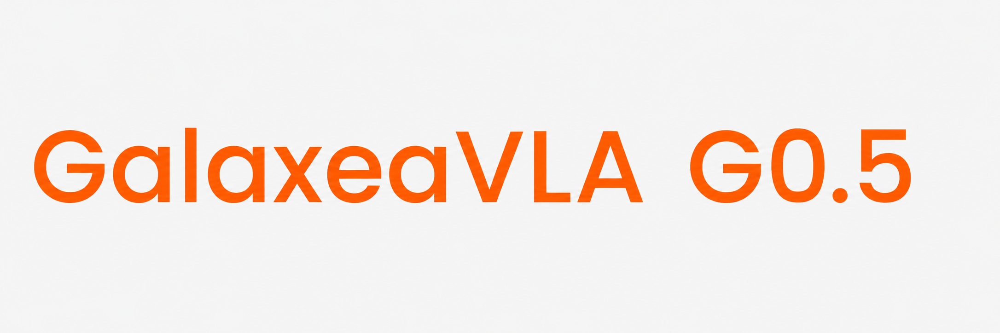

# GalaxeaVLA：G0.5 视觉-语言-动作模型

[](https://opengalaxea.github.io/G05/)
[](https://opengalaxea.github.io/G05/Galaxea_G0_5.pdf)
[](https://opengalaxea.github.io/G05/videos/introduction_g05.mp4)
[](https://huggingface.co/OpenGalaxea/G05)

[English](README.md) | 简体中文

<div align="left">
  
  
</div>


## 📢 最新动态

[2026 年 6 月 29 日] 我们新增 **G0.5** RoboTwin 2.0 评测支持，包括评测入口和 `g05-robotwin20` [权重](https://huggingface.co/OpenGalaxea/G05/tree/main/g05-robotwin20)。更多仿真 benchmark 的评测功能将很快更新。

[2026 年 6 月 17 日] 我们提供了 **G0.5** 在 so-100/101 本体上零样本推理部署的 `g05-so101` [权重](https://huggingface.co/OpenGalaxea/G05/tree/main/g05-so101)。

[2026 年 6 月 16 日] 我们提供了 **G0.5** 模型在 R1 Lite 和 DROID 本体上的零样本推理部署入口，并提供 LIBERO 仿真评测入口和 R1 Lite/R1 Pro 后训练微调支持。

[2026 年 6 月 1 日] 我们发布 **G0.5**，这是最新的自回归 VLA 模型，具备领先性能。请查看[项目主页](https://opengalaxea.github.io/G05/)。

[2026 年 2 月 12 日] 更新了在更大规模遥操作和网页数据上训练的 **G0Plus** 预训练权重。发布 **G0Tiny**（250M，SmolVLM2 骨干网络），用于 R1 Pro Orin 边缘部署。新增开箱即用的演示任务：**Fold Towels** 和 **Handover Gift**（通过 TensorRT 在设备端运行 G0Tiny 推理，最高 10 Hz）。新增基于 [openpi](https://github.com/Physical-Intelligence/openpi) 的 **pi0/pi0fast** 微调支持。

[2026 年 1 月 4 日] 我们发布 **G0Plus**，这是最新的预训练 VLA 模型，面向多任务机器人操作。

[2025 年 10 月 7 日] Galaxea 开放世界数据集现已以 LeRobot 格式发布在 [Hugging Face](https://huggingface.co/datasets/OpenGalaxea/Galaxea-Open-World-Dataset)！

[2025 年 9 月 17 日] 发布 G0-VLA 微调和真实机器人推理代码。

[2025 年 9 月 9 日] 在 [Hugging Face](https://huggingface.co/OpenGalaxea/G0-VLA) 和 [ModelScope](https://www.modelscope.cn/models/Galaxea/G0-VLA) 发布 G0-VLA 预训练模型权重！

[2025 年 9 月 9 日] 在 [Hugging Face](https://huggingface.co/datasets/OpenGalaxea/Galaxea-Open-World-Dataset) 和 [ModelScope](https://www.modelscope.cn/datasets/Galaxea/Galaxea-Open-World-Dataset) 发布 Galaxea 开放世界数据集！


## 📌 G0.5 概览

**G0.5** 是 Galaxea 面向通用机器人控制的预训练自回归视觉-语言-动作模型。G0.5 没有仅把 VLM 用作独立动作专家的视觉语言编码器，而是保留 VLM 作为执行器：单个 transformer decoder 在统一的自回归流中生成推理 token 和动作 token，并使用同一个 next-token prediction 目标。

G0.5 技术报告中的核心思路：

1. **统一的自回归 VLA**
   - G0.5 以多视角 RGB 观测、本体标识、自然语言任务指令和机器人本体状态作为条件输入。
   - 模型可以先输出具身推理，再在同一个生成流中继续输出结构化动作 token。
   - 动作 token 被解码为连续机器人控制，以 chunk 形式执行，并基于新的观测进行闭环重规划。

2. **跨本体 ActionCodec**
   - 异构机器人动作被映射到共享的 27 维动作空间：
     `left_control(9) | left_gripper(1) | right_control(9) | right_gripper(1) | lower_body(7)`。
   - 学习得到的 residual vector-quantized action tokenizer 表示语义对齐的运动组，例如左臂、右臂和下半身。
   - 动作生成时只输出活跃运动组，避免为空闲自由度生成不必要的 padding。

3. **面向控制的原生 chain-of-thought**
   - G0.5 将推理和动作训练为同一个 token 序列，而不是把推理视为外部模块或仅训练时使用的辅助目标。
   - chain-of-thought 片段可以包含 `Subtask`、`BBox`、`Trace` 和 `ActionHint` 字段，用于任务分解、目标定位、二维夹爪轨迹和帧级运动提示。
   - 这种设计提升了 grounding 和长时程执行能力，因为生成出的推理会直接被后续动作 token 看到。

4. **视觉记忆**
   - G0.5 通过视觉编码器和分解式时空注意力注入多秒级视觉历史。
   - 预训练使用在 5 秒窗口内采样的 6 帧，并通过随机历史帧 dropout 降低过拟合。
   - 历史 token 会在最后一层被丢弃，以保持推理延迟有界。

5. **预训练与评测**
   - G0.5 从 Qwen3.5 2B VLM 初始化，并在来自 14 种本体的机器人演示数据以及大规模网页和具身 VQA 数据上预训练。
   - 机器人动作样本和 VQA 样本使用同一个交叉熵目标优化，并以 1:4 的 VQA-to-action 比例混合。
   - 模型在多种设置中表现强劲，包括 DROID 零样本成功率 82.5%、Bridge-SimplerEnv 87.3%、RoboTwin 2.0 93.3%、LIBERO 98.9%、BEHAVIOR-1K 任务成功分 0.3136，以及在 R1-Lite/R1-Pro 上真实世界微调后的平均成功率 76.7%。

<p align="center">
  
  <br>
  <em>G0.5 Tokenizer</em>
</p>

<p align="center">
  
  <br>
  <em>G0.5 Token Sequence Template</em>
</p>

## 📌 历史 G0 / G0Plus 概览

本节保留早期 GalaxeaVLA 版本中的 G0Plus 概览，方便追溯项目历史。G0Plus 和 G0Tiny 属于旧版 G0/G0Plus 发布线；当前分支的主要内容已经切换到 G0.5，不再包含旧版 G0Plus Dockerfile、Fold Towels/Handover Gift 演示指南或 pi0/pi0fast 训练配置。如需复现旧版 README 和文件布局，请查看 commit [13a16a9](https://github.com/OpenGalaxea/GalaxeaVLA/tree/13a16a9049aee8f1d799b56fccc0c5832a75fc2f)。历史权重仍位于 [G0-VLA Hugging Face 仓库](https://huggingface.co/OpenGalaxea/G0-VLA)，包括：

   - **G0Plus_3B-base**：使用 **2k+ 小时**真实世界机器人数据预训练，可用于自定义任务微调。
   - **G0Tiny_250M-base**：轻量级预训练模型，使用 **1k 小时** R1 Pro VR 遥操作数据训练，面向 R1 Pro Orin 边缘部署。
   - **G0Plus_3B-pick_and_place**：面向 pick-and-place 部署的后训练权重。
   - Pick Up Anything、Fold Towels 和 Handover Gift 的 **demo**。
   - 基于 openpi 的 **pi0/pi0fast** 微调。

## 🚀 Galaxea 开放世界数据集

### **主要特性**

- **500+ 小时**真实世界移动操作数据。
- 所有数据都使用**统一机器人本体**采集，以保证一致性。
- 细粒度的**子任务语言标注**。
- 覆盖**住宅**、**厨房**、**零售**和**办公**场景。
- 数据集提供 **RLDS** 和 **LeRobot** 格式。

更多数据集格式和示例细节见[这里](docs/data/schema.md)。


## ⚙️ G0.5 快速开始

### GPU 要求

要运行本仓库中的 G0.5 预训练模型，需要至少满足以下规格的 NVIDIA GPU。这些估算基于单 GPU。

通过 [scripts/run/finetune.sh](scripts/run/finetune.sh) 启动的多 GPU 微调默认使用 `torchrun` 分布式数据并行。它可以提升吞吐，但每张 GPU 都会保留完整模型副本，因此不应描述为模型并行，也不会降低单卡模型显存。多机运行由 `WORLD_SIZE`、`RANK`、`MASTER_ADDR` 和 `MASTER_PORT` 等环境变量控制。

| 模式               | 显存要求 | 示例 GPU                 |
| ------------------ | -------- | ------------------------ |
| 推理               | > 8 GB   | RTX 3090 / **RTX 4090（推荐）** |
| 全量微调           | > 70 GB  | A100 (80GB) / H20 (96GB) |

### 安装

已测试环境：

- Linux
- Python `>=3.10.16,<3.11`
- CUDA 12.8 与 PyTorch 2.7.1 `cu128` wheel
- `flash-attn-4`、`flash-linear-attention` 等原生 CUDA 扩展；请确保 CUDA runtime、编译工具链和 PyTorch 构建匹配
- 视频数据集和评测需要 `ffmpeg`

```bash
git clone https://github.com/OpenGalaxea/GalaxeaVLA
cd GalaxeaVLA

# 运行环境
uv sync --index-strategy unsafe-best-match

# 如需开发和测试依赖，改用
uv sync --extra dev --index-strategy unsafe-best-match

source .venv/bin/activate
```

安装前请注意：

1. 我们建议在不使用 conda 环境的情况下[安装 uv](https://docs.astral.sh/uv/getting-started/installation/)。
2. 如果遇到网络问题，建议尝试以下 uv 环境变量：
   ```bash
   export UV_DEFAULT_INDEX=https://mirrors.aliyun.com/pypi/simple/
   export UV_PYTHON_INSTALL_MIRROR=https://gh-proxy.com/https://github.com/astral-sh/python-build-standalone/releases/download
   ```


### 模型检查点

请将 Hugging Face 仓库下载到 `checkpoints/`，保持本地路径与当前配置一致：

```bash
huggingface-cli download OpenGalaxea/G05 \
    --repo-type model \
    --local-dir checkpoints \
    --local-dir-use-symlinks False
```

下载后的期望目录结构：

```text
checkpoints/
├── action_tokenizer.pt
├── qwen3_5_2b_base_processor/
├── g05-base/
│   ├── .hydra/config.yaml
│   ├── checkpoints/model_state_dict.pt
│   └── dataset_stats.json
├── g05-so101/
│   ├── .hydra/config.yaml
│   ├── checkpoints/model_state_dict.pt
│   └── dataset_stats.json
├── g05-droid/
│   ├── .hydra/config.yaml
│   ├── checkpoints/model_state_dict.pt
│   └── dataset_stats.json
├── g05-libero/
│   ├── .hydra/config.yaml
│   ├── model.pt
│   └── dataset_stats.json
└── g05-robotwin20/
    ├── .hydra/config.yaml
    ├── checkpoints/model_state_dict.pt
    └── dataset_stats.json
```

包含 RoboTwin checkpoint 时，完整权重约 55 GB。每个 G0.5 模型检查点约 11 GB，共享的 `action_tokenizer.pt` 约 484 MB，`qwen3_5_2b_base_processor/` 约 22 MB。

| 模型 | 用途 | 本地 `--ckpt_path` |
| ---- | ---- | ------------------ |
| [G05-base](https://huggingface.co/OpenGalaxea/G05/tree/main/g05-base) | 微调和 R1 Lite 零样本部署 | `checkpoints/g05-base/checkpoints/model_state_dict.pt` |
| [G05-so101](https://huggingface.co/OpenGalaxea/G05/tree/main/g05-so101) | SO-100/101 零样本部署 | `checkpoints/g05-so101/checkpoints/model_state_dict.pt` |
| [G05-droid](https://huggingface.co/OpenGalaxea/G05/tree/main/g05-droid) | DROID 零样本部署 | `checkpoints/g05-droid/checkpoints/model_state_dict.pt` |
| [G05-libero](https://huggingface.co/OpenGalaxea/G05/tree/main/g05-libero) | LIBERO 评测 | `checkpoints/g05-libero/model.pt` |
| [G05-robotwin20](https://huggingface.co/OpenGalaxea/G05/tree/main/g05-robotwin20) | RoboTwin 2.0 评测 | `checkpoints/g05-robotwin20/checkpoints/model_state_dict.pt` |

请保留每个 checkpoint 旁边的 `.hydra/config.yaml` 和 `dataset_stats.json`。推理和评测入口会从 checkpoint 父目录向上解析 `dataset_stats.json`，配置默认使用 `checkpoints/qwen3_5_2b_base_processor` 作为共享 processor，并使用 `checkpoints/action_tokenizer.pt` 作为共享 action tokenizer。

LIBERO 导出的配置会引用 bundle 内部 sidecar。下面的 `eval_libero.sh` 命令依赖这些路径。如果下载工具没有生成这些文件，请创建软链接：

```bash
ln -sf ../action_tokenizer.pt checkpoints/g05-libero/action_tokenizer.pt
ln -sfn ../qwen3_5_2b_base_processor checkpoints/g05-libero/hf_processor
```


### 真实机器人推理

真实机器人部署采用服务端/客户端架构。GPU 机器运行本仓库中的 G0.5 策略服务端，机器人端客户端采集原始观测，通过 WebSocket + msgpack 发送观测，接收 action chunk 并执行。

#### R1 Lite

在 GPU 机器上启动策略服务端：

```bash
python scripts/serve_policy.py \
    --ckpt_path checkpoints/g05-base/checkpoints/model_state_dict.pt \
    --host 0.0.0.0 \
    --port 8080 \
    --device cuda \
    --action_steps 16 \
    eval_embodiment=galaxea_r1lite
```

在 `experiments/r1lite/config.toml` 中设置服务端地址后，在机器人机器上启动 R1 Lite 客户端：

```bash
source /opt/ros/humble/setup.bash
source .venv/bin/activate
cd experiments/r1lite
python run.py --config config.toml
```

ROS2 话题、客户端/服务端协议、指令文件、录制和测试细节见 [experiments/r1lite/README.md](experiments/r1lite/README.md)。

#### SO-100 / SO-101

SO-100/101 部署使用同一个 G0.5 策略服务端，并搭配轻量级 LeRobot 客户端。先在 GPU 机器上启动策略服务端：

```bash
bash experiments/so100/start_server.sh checkpoints/g05-so101/checkpoints/model_state_dict.pt
```

然后在另一个终端或机器人机器上配置并启动客户端：

```bash
conda env create -f experiments/so100/environment.yml
conda activate lerobot
bash experiments/so100/start_client.sh
```

运行客户端前，请在 `experiments/so100/start_client.sh` 中更新相机索引和 camera-slot 映射。详见 [experiments/so100/README.md](experiments/so100/README.md)。

#### DROID / Franka

DROID 部署由本仓库提供 G0.5 策略服务，并使用独立的
[OpenGalaxea/droid-franka-client](https://github.com/OpenGalaxea/droid-franka-client)
仓库控制机器人。先在 GPU 机器上启动策略服务端：

```bash
CHECKPOINT_DIR=checkpoints/g05-droid \
POLICY_PORT=8000 \
POLICY_DEVICE=cuda:0 \
bash experiments/droid/start_server.sh \
    model.model_arch.discrete_action=true model.model_arch.continuous_action=false
```

然后克隆并配置机器人端客户端：

```bash
git clone git@github.com:OpenGalaxea/droid-franka-client.git
```

完整设置和协议约定见 [experiments/droid/README.md](experiments/droid/README.md) 与 [experiments/droid/PROTOCOL.md](experiments/droid/PROTOCOL.md)。

### LIBERO 评测

LIBERO 评测同样使用服务端/客户端设置。这个命令会在后台启动批处理策略服务端，为每个 LIBERO suite 启动一个并行客户端，并在评测结束后停止服务端。

```bash
bash scripts/run/eval_libero.sh checkpoints/g05-libero/model.pt \
    --num_trials 50 \
    --num_parallel 10 \
    --save_videos
```

默认情况下，脚本会评测 `libero_goal`、`libero_spatial`、`libero_object` 和 `libero_10`，然后把每个 suite 的日志和 `summary.json` 写入 `outputs/libero_eval_<checkpoint_name>/`。使用 `--suites "libero_goal libero_10"` 可以只运行子集；需要时也可以追加 Hydra 风格的 override，例如 `model.model_arch.discrete_action=false`。

LIBERO 安装说明、生成的路径配置、输出布局和单 suite 调试命令见 [experiments/libero/README.md](experiments/libero/README.md)。

### RoboTwin 评测

RoboTwin 评测运行在 RoboTwin 仿真器中，需要额外的仿真依赖和 assets。它使用单独的 `.venv-robotwin` 环境，避免仿真器所需的 `sapien` 3.x 覆盖主仓库环境。请按照 [experiments/robotwin/README_zh.md](experiments/robotwin/README_zh.md) 克隆 RoboTwin、下载 assets、创建 `.venv-robotwin`，并完成渲染验证。

全量 RoboTwin 任务集评测命令：

```bash
.venv-robotwin/bin/python -u experiments/robotwin/run_robotwin_manager.py \
    task=robotwin \
    ckpt=checkpoints/g05-robotwin20/checkpoints/model_state_dict.pt \
    EVALUATION.robotwin_root=third_party/RoboTwin \
    MULTIRUN.num_gpus=8 \
    MULTIRUN.max_tasks_per_gpu=1
```

该命令会使用配置中的 episode 数量评测 RoboTwin `_eval_step_limit.yml` 中的全部任务。标准 `g05-robotwin20` 目录结构下，`dataset_stats.json` 会自动从 checkpoint 父目录向上解析；只有 stats 文件放在其他位置时，才需要传 `EVALUATION.dataset_stats_path=/path/to/dataset_stats.json`。汇总结果写入 `evaluate_results/robotwin/<ckpt_tag>/<timestamp>/`，RoboTwin 渲染视频保留在 `third_party/RoboTwin/eval_result/`。

### 🔥 在 Galaxea 机器人上微调基础模型

如需使用自己的数据微调模型，请按以下四步操作。配置层级和常见修改位置见 [configs/QUICK_START.md](configs/QUICK_START.md)。

1. 在 `configs/task/` 下创建或调整 task config，并在 `configs/data/` 下更新对应数据集路径。Galaxea 机器人微调可从以下配置开始：
   - R1 Lite：[configs/task/r1lite.yaml](configs/task/r1lite.yaml)，数据集路径在 [configs/data/r1lite.yaml](configs/data/r1lite.yaml) 中更新。
   - R1 Pro 关节空间训练：[configs/task/r1pro.yaml](configs/task/r1pro.yaml)，数据集路径在 [configs/data/r1pro.yaml](configs/data/r1pro.yaml) 中更新。
   - R1 Pro 包含躯干状态/动作的 WBC 训练：[configs/task/r1pro_wbc.yaml](configs/task/r1pro_wbc.yaml)，数据集路径在 [configs/data/r1pro_wbc.yaml](configs/data/r1pro_wbc.yaml) 中更新。

   这三类 Galaxea 机器人数据配置都包含示例本地数据路径，训练前必须替换：
   - R1 Lite：替换 `configs/data/r1lite.yaml` 中的 `data/r1lite/task*_lerobot`。
   - R1 Pro：替换 `configs/data/r1pro.yaml` 中的 `data/r1pro/fold_carton_lerobot`。
   - R1 Pro WBC：替换 `configs/data/r1pro_wbc.yaml` 中的 `data/r1pro_wbc/stack_box_lerobot`。

   这些路径应指向你的本地 LeRobot 数据集目录。

2. 安装所需软件包。

   ```bash
   sudo apt install ffmpeg
   ```

3. 设置环境变量。
    - `G05_OUTPUT_DIR`：`configs/train.yaml` 必需；检查点和 Hydra 日志会写入该目录。
    - `HF_HOME` / `HF_HUB_CACHE`：推荐用于 Hugging Face 模型和 tokenizer snapshot 的缓存位置。
    - `HF_DATASETS_CACHE`：推荐用于 Hugging Face dataset 和 LeRobot metadata 的缓存位置。
    - `LIBERO_CONFIG_PATH`：仅 LIBERO 仿真评测需要。它指向 LIBERO 读取或写入 `config.yaml` 的目录，其中包含 `bddl_files`、`init_states`、`assets` 和数据集路径。
    - `SWANLAB_API_KEY`：仅当 `logger.type=swanlab` 时需要。
    - `WANDB_API_KEY`：仅当 `logger.type=wandb` 且 `logger.mode=online` 时需要。

    ```bash
    export HF_ENDPOINT=https://hf-mirror.com
    export HF_HOME=<YOUR_HF_CACHE_ROOT>
    export HF_HUB_CACHE=$HF_HOME/hub
    export HF_DATASETS_CACHE=$HF_HOME/datasets
    export G05_OUTPUT_DIR=<YOUR_OUTPUT_DIR>
    export LIBERO_CONFIG_PATH=$(pwd)/experiments/libero
    export SWANLAB_API_KEY=<YOUR_SWANLAB_API_KEY>
    ```

    复制仓库本地环境模板，并填写机器相关路径和可选 API key：

    ```bash
    cp .env.example .env
    source .env
    ```

4. 运行微调。

   ```bash
   bash scripts/run/finetune.sh <num_of_gpu> <task_path>

   # dry-run：解析配置后退出，不进入训练
   bash scripts/run/finetune.sh 1 r1pro --dry-run --max_datasets 1

   # 单卡 smoke test
   bash scripts/run/finetune.sh 1 r1pro --test --max_datasets 1 model.max_steps=<num_steps>

   # 多 GPU 示例：
   bash scripts/run/finetune.sh 8 r1lite
   bash scripts/run/finetune.sh 8 r1pro
   bash scripts/run/finetune.sh 8 r1pro_wbc
   ```

   R1 Pro 配置使用 grouped 27D ActionCodec 布局：
   `left_control(9) | left_gripper(1) | right_control(9) | right_gripper(1) | lower_body(7)`。
   WBC 版本会通过 [configs/data/parts_meta/r1pro.yaml](configs/data/parts_meta/r1pro.yaml) 将 `torso` 合并到 `lower_body` 组。

#### 微调 FAQ

1. Q: 如何将我的数据转换为 [LeRobot](https://github.com/huggingface/lerobot) 数据集？

   A: 我们在 Hugging Face 上提供了用于快速测试的[演示数据集](https://huggingface.co/OpenGalaxea/G0-VLA/tree/main/G0Plus_Finetune_LeRobot_Datasets_Demo)。

2. Q: 为什么在 SwanLab 中看不到训练日志？

   A: 请确认你已在 [train.yaml](configs/train.yaml) 中设置自己的 SwanLab `workspace`。

3. Q: 为什么找不到预训练模型？

   A: G0.5 模型配置是 [g05.yaml](configs/model/g05.yaml)。如果检查点位于自定义路径，请更新 `model.model_arch.pretrained_model_path` 或任务级 `model.pretrained_ckpt`。

4. Q: 为什么会出现 out-of-memory (OOM) 错误？

   A: 请确认你具备上文提到的充足 GPU 显存。或者，在 [configs/task](configs/task) 下对应的 task config 中减小 `model.batch_size`。

### 最小验证

安装并下载 checkpoint 后，建议先运行轻量检查，再启动高成本任务：

```bash
python tools/resolve_config.py r1pro --key model.model_arch
python tools/resolve_config.py r1pro --key data.embodiment_datasets.galaxea_r1pro.dataset_groups
python -c "import torch, g05; print(torch.__version__); print(g05.__file__)"
```

测试按运行依赖区分。合成数据/单元测试不需要真实机器人数据；serving、pretrained-policy 和 dataset 相关测试需要 CUDA、已下载的 checkpoint 或本地 LeRobot 数据集。LIBERO 批量评测还依赖 Linux `ss` 命令，因为 [scripts/run/eval_libero.sh](scripts/run/eval_libero.sh) 会用它等待 policy server 端口就绪。

## 致谢

本项目建立在开源社区既有工作的基础上。实现受到 [open-pi-zero](https://github.com/allenzren/open-pi-zero)、[OpenVLA](https://github.com/openvla/openvla)、[Octo](https://github.com/octo-models/octo)、[OpenPI](https://github.com/Physical-Intelligence/openpi) 和 [LeRobot](https://github.com/huggingface/lerobot) 的启发，实验使用了包括 [OXE](https://github.com/google-deepmind/open_x_embodiment)、[RDT](https://github.com/thu-ml/RoboticsDiffusionTransformer)、[BridgeV2](https://github.com/rail-berkeley/bridge_data_v2) 和 [DROID](https://github.com/droid-dataset/droid) 在内的数据集。我们衷心感谢这些项目的作者公开代码和数据。


## 📜 引用

如果使用我们的数据集或模型，请引用：

```bibtex
@article{galaxea2026g05,
  title={Galaxea G0.5 Technical Report},
  author={Galaxea Team},
  year={2026},
  url={https://opengalaxea.github.io/G05/Galaxea_G0_5.pdf}
}
```

## 许可证

本仓库包含根据提交日期适用不同许可证的材料：
- Apache-2.0（历史版本）：2026-01-04 之前提交的所有内容均基于 Apache License 2.0 授权。
- G0 PLUS Community License Agreement：2026-01-04 当日或之后、且 2026-06-16 之前提交的所有内容均基于 G0 PLUS Community License（Non-Commercial + Limited Patent License）授权。详见 [G0 Plus Community License Agreement](licenses/LICENSE-G0Plus)。
- G0.5 Community License Agreement：2026-06-16 当日或之后提交的所有内容均基于 G0.5 Community License（Non-Commercial + Limited Patent License）授权。详见 [G0.5 Community License Agreement](licenses/LICENSE-G0.5)。

为避免疑义，存在两个许可证边界，每个边界均由首次引入相应许可证切换的 commit 决定：
- 边界 1（Apache-2.0 / G0 PLUS）：G0 PLUS 许可证下的第一个 commit（引入 G0 PLUS 许可证切换）：[38b31e4](https://github.com/OpenGalaxea/GalaxeaVLA/tree/38b31e4f732ef28719a5458a18e2836dd52f9d12)
- 边界 2（G0 PLUS / G0.5）：G0.5 许可证下的第一个 commit（引入 G0.5 许可证切换）：[dc0a1ef](https://github.com/OpenGalaxea/GalaxeaVLA/tree/dc0a1ef4531256adea4ee9f3d7d2fa44613cb866)

如果日期描述与 commit hash 存在任何不一致，以 commit hash 为准。

### G0.5 Community License 下允许的用途

你可以仅出于非商业目的使用、复制、修改和分发 G0.5 材料，例如学术研究、个人使用、教育和评测。商业使用（包括生产部署、向第三方提供服务或产品化）需要从我们这里获取单独的商业许可证。

G0.5 材料包括模型代码、权重、配置、训练/推理脚本、文档和配套材料。详见 [LICENSE-G0.5](./LICENSE-G0.5) 和 [licenses/LICENSE-G0.5](licenses/LICENSE-G0.5)。

### 声明与署名

如果重新分发 G0.5 材料的任何部分，必须包含：
- G0.5 Community License Agreement 的副本或链接；
- 本仓库中的 NOTICE 文件；
- 对已修改文件的醒目变更声明。

### 第三方许可证

G0.5 使用 Qwen3.5 作为预训练 VLM 骨干模型，并包含 Qwen3.5 派生的实现组件。Qwen3.5 模型权重、配置文件和相关上游材料由 Qwen 基于 Apache License 2.0 授权。详见 [LICENSE_QWEN3_5.txt](./LICENSE_QWEN3_5.txt)。

### 法律与安全合规

本仓库发布本身不构成面向公众提供的生成式人工智能服务。如果你部署、微调、再分发或对外暴露任何模型、服务、输出或机器人控制流程，你需要自行确保符合适用法律法规，包括数据权益、个人信息保护、安全评估或备案、内容安全、生成合成内容标识以及机器人安全等要求。

## Star 历史

[](https://www.star-history.com/#OpenGalaxea/GalaxeaVLA&type=date&legend=top-left)
